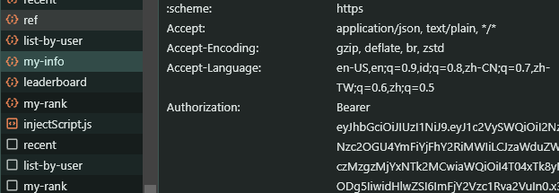

# UNICH AUTO MINING 


## Features

- **Auto Complete Tasks**
- **Auto Start Mines Daily**
- **Support Multy Accounts**

## Requirements

- **Node.js**: Ensure you have Node.js installed.
- **npm**: Ensure you have npm installed.

## register/login 
- go to here [https://unich.com/en/airdrop](https://unich.com/en/airdrop/sign-up?ref=67KYJE) to register or login
- F12 to inspect after you login to get token 
- copy your token and paste to `tokens.txt`


## Setup

   ```


## 

This project is licensed under the [MIT License](LICENSE).
